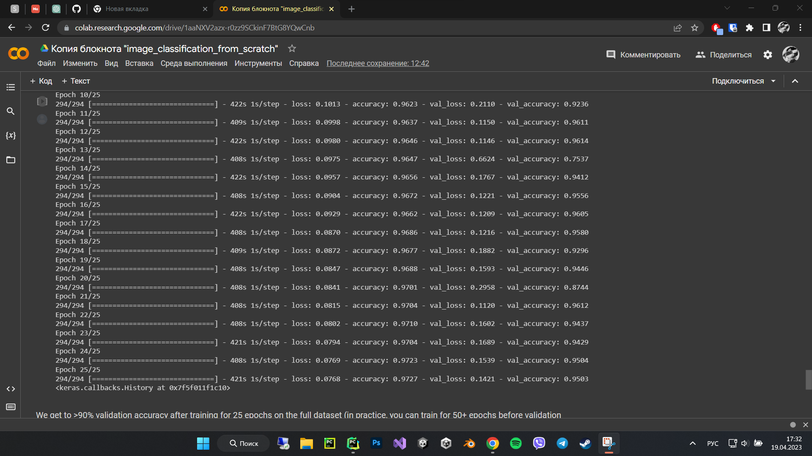
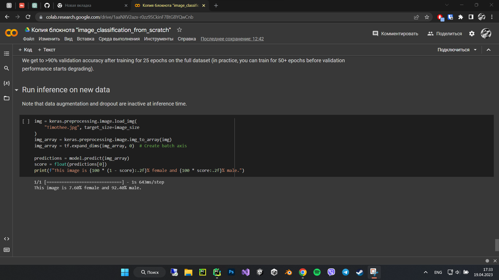

# Gender classification

* Just a sample of the Flask + Google Collab project for classification




[Google Collab link](https://colab.research.google.com/drive/1aaNXV2azx-r0zz9SCkinF7BtG8YQwCnb?usp=sharing)

## How to start

```shell
git clone https://github.com/yhwh6/Gender_classification.git
cd Gender_classification
python -m venv venv
source venv/bin/activate # on MacOS
venv\Scripts\activate # on Windows
pip install -r requirements.txt
app run
```
